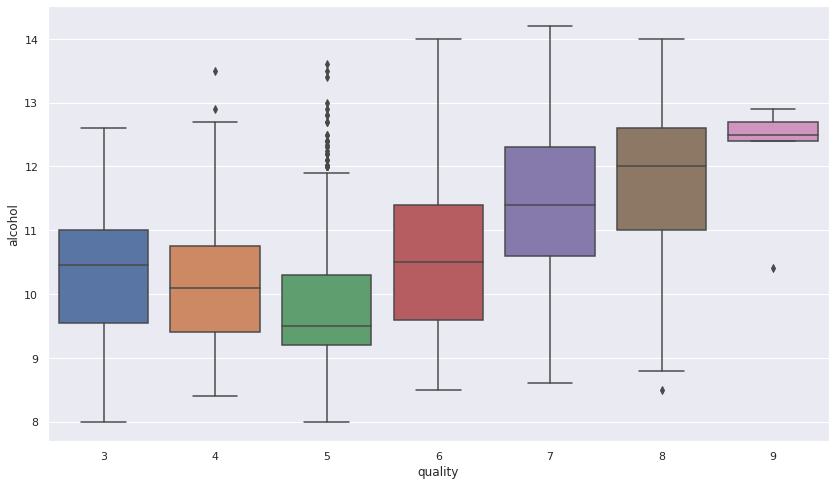

# 🍷 Analysing wine with neural networks and EDA 😋

## Project

<i>What else?</i>

Who doesn't like a good wine, isn't it? Me, I don't drink acohol 😬😑. What a douche! But someone has to remember the bar story in the other day! But guess what: even machine learning algorithms like wine. 

This project has incredible approaches about data analysis in machine learning technologies. It was one of the funniest to code I've ever wrote. Let's check it out.

### EDA (Exploratory Data Analysis) 📊📉 

EDA consists basically of making numbers express an image. That's perfect for presentations where one may need visual understanding of data! In this project I use a lot of codes from differents libraries that permit us to see what numbers are too much confusing to say.

	fixed acidity	volatile acidity	citric acid	residual sugar	chlorides	free sulfur dioxide	total sulfur dioxide	density	pH	sulphates	alcohol	quality
0	7.0	0.27	0.36	20.7	0.045	45.0	170.0	1.00100	3.00	0.45	8.8	6
1	6.3	0.30	0.34	1.6	0.049	14.0	132.0	0.99400	3.30	0.49	9.5	6
2	8.1	0.28	0.40	6.9	0.050	30.0	97.0	0.99510	3.26	0.44	10.1	6
3	7.2	0.23	0.32	8.5	0.058	47.0	186.0	0.99560	3.19	0.40	9.9	6
4	7.2	0.23	0.32	8.5	0.058	47.0	186.0	0.99560	3.19	0.40	9.9	6
...	...	...	...	...	...	...	...	...	...	...	...	...
4893	6.2	0.21	0.29	1.6	0.039	24.0	92.0	0.99114	3.27	0.50	11.2	6
4894	6.6	0.32	0.36	8.0	0.047	57.0	168.0	0.99490	3.15	0.46	9.6	5
4895	6.5	0.24	0.19	1.2	0.041	30.0	111.0	0.99254	2.99	0.46	9.4	6
4896	5.5	0.29	0.30	1.1	0.022	20.0	110.0	0.98869	3.34	0.38	12.8	7
4897	6.0	0.21	0.38	0.8	0.020	22.0	98.0	0.98941	3.26	0.32	11.8	6

<i>Number of wines per quality</i>

