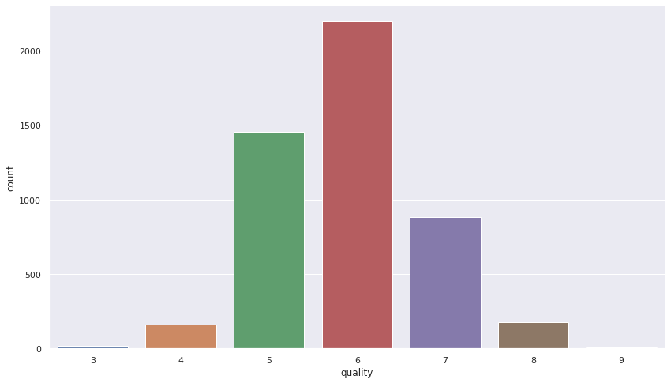
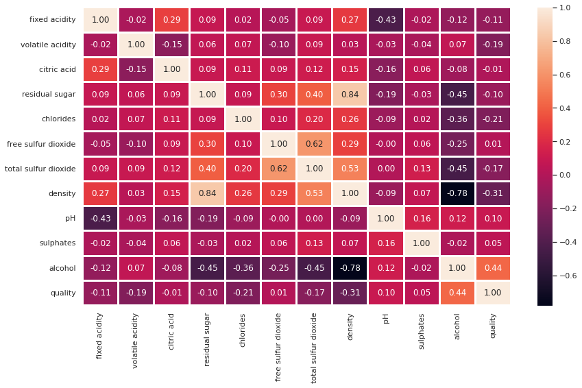
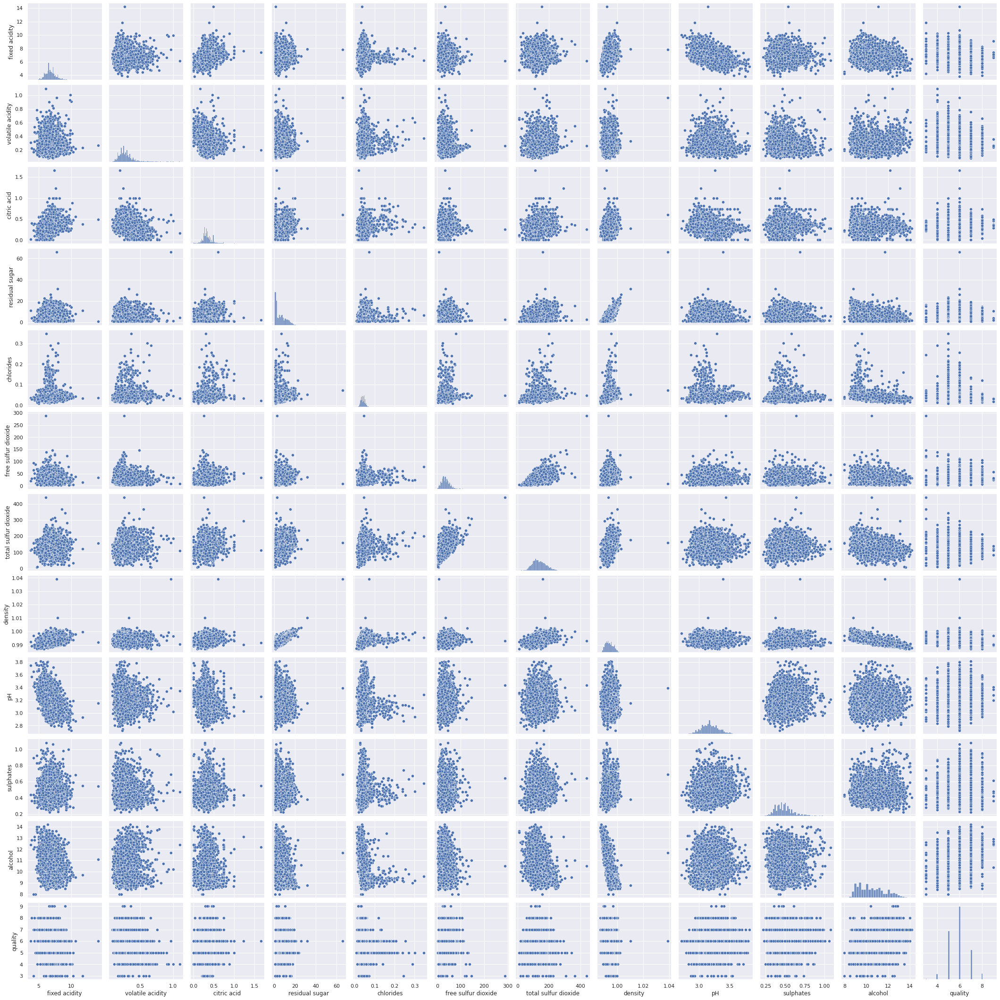
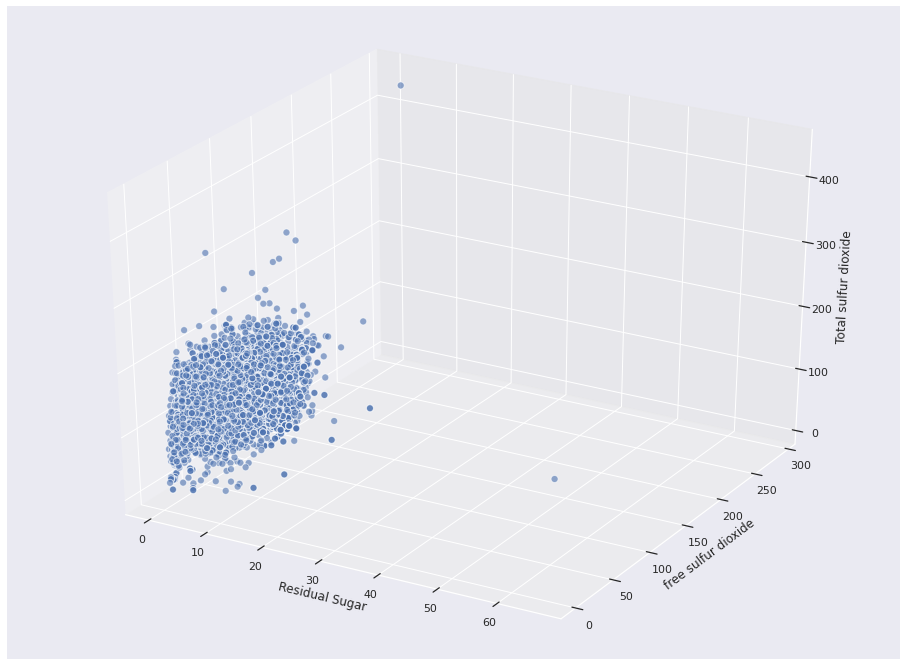

# 🍷 Analysing wine with neural networks and EDA 😋

## About the project

<div align="center"><p><i>What else?</i></p></div>

Who doesn't like a good wine, isn't it? Me, I don't drink acohol 😬😑. What a douche! But someone has to remember the bar story in the other day! But guess what: even machine learning algorithms like wine. 

This project has incredible approaches about data analysis in machine learning technologies. It was one of the funniest to code I've ever wrote. **It consists in a a neural network for linear regression that can preditcs wine quality through chemical analysis of the wine**. These chemical compounds are:

- Fixed acidity;
- Volatile acidity;
- Citric acid;
- Residual sugar;
- Chlorides;
- Free sulfurdioxide;
- Total sulfur dioxide;
- Density;
- pH;
- Sulphates;
- Alcohol;
- Quality.

The dataset will looks like this:

<div align="center"></div>

Let's check it out.

### EDA (Exploratory Data Analysis) 📊📉 

EDA consists basically of making numbers express an image. That's perfect for presentations where one may need visual understanding of data! In this project I use a lot of codes from differents libraries that permit us to see what numbers are too much confusing to say.

Let's check it out some of the EDA nice codes Python provides for us and see what it brings us from the dataset. Like if we want isolate the quality label to provide the amount of wines per quality:

```
import seaborn as sns
sns.set(rc={'figure.figsize': (14, 8)})
sns.countplot(dataset['quality'])
```

Which gives us:

<div align="center"><p align="center"><i>Number of wines per quality</i></p></div>

Fot total correlation among all labels. Heatmaps are my favorite:

```
sns.heatmap(dataset.corr(), annot=True, fmt='.2f', linewidths=2)
```
That produces:

<div align="center"><p align="center"><p align="center"><i>Total correlation among chemical compounds of wine</i></p></div>

Well, I'm not going to show all code lines that produce a good EDA of a dataset, for it coud be a stealing of several joyful moments of you checking out the code by yourself. Yay...

<div align="center"><p align="center"><i>Correlation dots</i></p></div>

<div align="center"><p align="center"><i>3D correlation among three labels</i></p></div>

So it goes on...

### Machine learning model

This project use three neural network models and comparatively analysis the efficiency among them. **For the Data Science process, this is one of most vital procediments.** Creating and analysing the result of different models it's a undisputed step of the machine learning paradigm.

```
print(f'Not gonna put it here again, check it out the archive with the codes!)
```

### RMSProp Optmization

Optmization functions are awesome to boost the speed of the training of the model instead of only gradient descent optmizer. Recently I read the most of winning algorithms of kaggle competitions uses optmization methods.  Here we use RMSProp, that accumulate the gradient omly for the recent iterations, which provides lighter processing.

Hope you enjoy reading the code:smile:!


